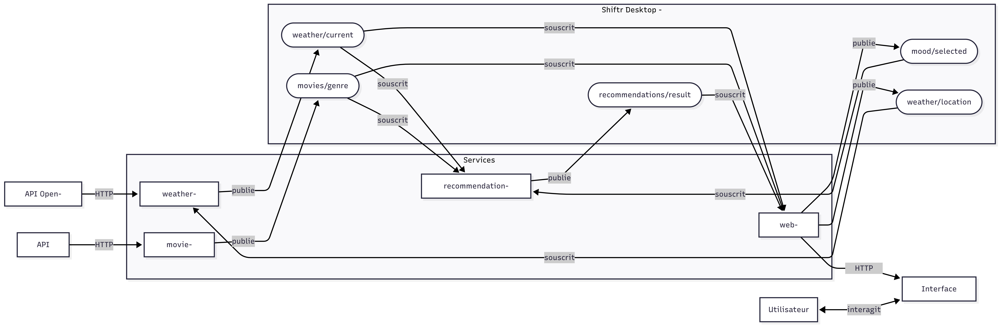

# 🎬 Ciné-Now

**Application de recommandation de films basée sur l'humeur et la météo**

Projet de Programmation Répartie - Rust

## 👥 Équipe
- Antoine LANDON

---

## 📖 Spécifications

### Données utilisées en entrée

**Depuis l'interface (Tauri) :**
- Humeur sélectionnée (joie, tristesse, colère, peur, fatigue, calme, aventure, réflexion)

**Depuis l'API météo (Open-Meteo) :**
- Température actuelle (°C)
- Condition météorologique (pluie, soleil, nuageux, neige, orage...)
- Heure de la journée (matin, après-midi, soir, nuit)

**Depuis l'API films (TMDb) :**
- Titre, synopsis, genres, note, affiche, acteurs, réalisateur, durée, date de sortie

### Traitements réalisés

- Algorithme de scoring : chaque film reçoit un score basé sur `rating × multiplicateur(humeur, météo)`
- Diversification : maximum 4 films par genre dans le top 20
- Géocodage inversé des coordonnées GPS en nom de ville

### Données enregistrées

- Catalogue de films par genre (en mémoire, via MQTT retained)
- Météo actuelle (en mémoire, mise à jour toutes les 15 min)

### Données présentées à l'utilisateur

- Conditions météo en temps réel (icône animée, température, ville, géolocalisation)
- Catalogue de films avec sorties récentes et à venir
- Recommandations personnalisées selon l'humeur et la météo
- Détails complets d'un film (synopsis, acteurs, réalisateur, durée)

---

## 🏗️ Architecture

**4 services Rust** communiquant via **MQTT (Shiftr Desktop)**  
**Interface hybride** : Tauri + React + Tailwind CSS



### Choix technologiques

**IPC : MQTT**  
Choisi pour sa légèreté, son modèle publish/subscribe adapté aux événements, et la simplicité de déploiement via Shiftr Desktop. L'ordre de démarrage des services n'est pas critique grâce aux messages retained.

**Interface : Tauri**  
Choisi pour son intégration native avec Rust, sa légèreté comparée à Electron, et la possibilité de créer une interface web moderne (React) tout en bénéficiant d'un exécutable natif.

### Topics MQTT

| Topic | Publié par | Souscrit par | Description |
|---|---|---|---|
| `weather/current` | weather-service | web-server, recommendation-service | Météo actuelle |
| `weather/location` | web-server | weather-service | Coordonnées GPS |
| `movies/{genre}` | movie-service | web-server, recommendation-service | Catalogue par genre |
| `mood/selected` | web-server | recommendation-service | Humeurs sélectionnées |
| `recommendations/result` | recommendation-service | web-server | IDs + scores recommandés |

### Routes HTTP (web-server, port 3001)

| Méthode | Route | Description |
|---|---|---|
| GET | `/weather` | Météo actuelle |
| GET | `/movies` | Catalogue complet par genre |
| GET | `/recommendations` | Films recommandés |
| GET | `/movie/:id` | Détails complets d'un film (fetch TMDb à la demande) |
| POST | `/mood` | Envoyer les humeurs sélectionnées |
| POST | `/location` | Envoyer les coordonnées GPS |

---

## 🚀 Installation

### Prérequis

#### 1. Rust (version 1.75 ou supérieure)
- **Windows** : https://rustup.rs/
- **Linux/Mac** :
  ```bash
  curl --proto '=https' --tlsv1.2 -sSf https://sh.rustup.rs | sh
  ```
  Sur les machines IUT, utiliser une version locale :
  ```bash
  export RUSTUP_HOME=~/.rustup
  rustup install stable
  ```

#### 2. Node.js (v18 ou supérieure)
- https://nodejs.org/

#### 3. Shiftr Desktop (broker MQTT)
- https://www.shiftr.io/desktop#downloads
- Interface de monitoring : http://localhost:3000
- Port MQTT : 1883

#### 4. Dépendances système Linux (pour Tauri)

Les dépendances suivantes sont le minimum requis, d'autres peuvent être nécessaires selon la distribution :

```bash
sudo apt update
sudo apt install \
  build-essential \
  pkg-config \
  libssl-dev \
  libglib2.0-dev \
  libgdk-pixbuf-2.0-dev \
  libpango1.0-dev \
  libatk1.0-dev \
  libgtk-3-dev \
  libwebkit2gtk-4.1-dev
```
> ⚠️ Sur Windows ces dépendances ne sont pas nécessaires (WebView2 intégré).

#### 5. Clé API TMDb (gratuite)
1. Créer un compte : https://www.themoviedb.org/signup
2. Aller dans **Settings → API → Request an API Key**
3. Choisir **Developer**, remplir le formulaire (Education/Student)
4. Copier la **API Key (v3 auth)**

### Configuration

1. Cloner le dépôt :
```bash
git clone https://gitlab.iut-valence.fr/canalsal/r5.a_08-cinenow.git
cd r5.a_08-cinenow
```

2. Copier et configurer le fichier d'environnement :
```bash
# Linux/Mac
cp .env.example .env

# Windows
Copy-Item .env.example .env
```

3. Remplir `.env` avec votre clé TMDb

4. Compiler le projet :
```bash
cargo build
cd ui && npm install
```

---

## ▶️ Lancement

### Mode développement

1. Lancer **Shiftr Desktop**
2. Exécuter le script :

**Windows** — lance les services ET l'interface Tauri automatiquement :
```powershell
.\scripts\run-dev.ps1
```

**Linux** — lance uniquement les services Rust :
```bash
chmod +x scripts/run-dev.sh
./scripts/run-dev.sh
```

> ⚠️ Sur Linux, l'interface Tauri doit être lancée manuellement après avoir installé les dépendances système (voir prérequis) :
> ```bash
> cd ui && npm run tauri dev
> ```

Ou manuellement dans des terminaux séparés (dans cet ordre) :
```bash
cargo run -p weather-service
cargo run -p movie-service
cargo run -p recommendation-service
cargo run -p web-server
cd ui && npm run tauri dev 
```

### Mode release

1. Lancer **Shiftr Desktop**
2. Exécuter le script :

**Windows** — compile tout, lance les services et ouvre le dossier pour lancer l'exe Tauri :
```powershell
.\scripts\run-release.ps1
```

**Linux** — compile et lance uniquement les services Rust :
```bash
./scripts/run-release.sh
```

> ⚠️ Sur Linux, lancer ensuite l'interface manuellement :
> ```bash
> cd ui && npm run tauri build  # si pas encore compilé
> ./ui/src-tauri/target/release/CineNow
> ```

3. **Windows** : Double-cliquer sur l'exe **Ciné-Now** dans le dossier `target/release/` qui s'ouvre automatiquement.

---

## 🧪 Tests

```bash
# Tous les tests (unitaires + intégration)
cargo test

# Par service
cargo test -p weather-service
cargo test -p recommendation-service

# Tests d'intégration uniquement
cargo test -p weather-service --test integration_test
cargo test -p recommendation-service --test integration_test

# Tests unitaires uniquement
cargo test -p weather-service --lib
cargo test -p recommendation-service --lib
```

---

## 📚 Documentation

- [Cahier des charges](docs/cahier_des_charges.md)
- [Architecture détaillée](docs/architecture.md)