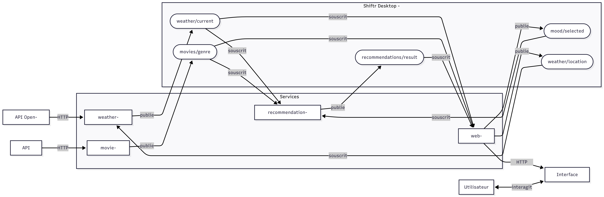

# 🎬 Ciné-Now

**Application de recommandation de films basée sur l'humeur et la météo**

Projet de Programmation Répartie - Rust

## 👥 Équipe
- Antoine LANDON

---

## 📖 Spécifications

### Données utilisées en entrée

**Depuis l'interface (Tauri) :**
- Humeur sélectionnée (joie, tristesse, colère, peur, fatigue, calme, aventure, réflexion)

**Depuis l'API météo (Open-Meteo) :**
- Température actuelle (°C)
- Condition météorologique (pluie, soleil, nuageux, neige, orage...)
- Heure de la journée (matin, après-midi, soir, nuit)

**Depuis l'API films (TMDb) :**
- Titre, synopsis, genres, note, affiche, acteurs, réalisateur, durée, date de sortie

### Traitements réalisés

- Algorithme de scoring : chaque film reçoit un score basé sur `rating × multiplicateur(humeur, météo)`
- Matrice d'affinité pilotée par des données (fichiers TOML), sans logique codée en dur
- Diversification : maximum 4 films par genre dans le top 20
- Géocodage inversé des coordonnées GPS en nom de ville

### Données enregistrées

- Catalogue de films par genre (en mémoire, via MQTT retained)
- Météo actuelle (en mémoire, mise à jour toutes les 15 min)

### Données présentées à l'utilisateur

- Conditions météo en temps réel (icône animée, température, ville, géolocalisation)
- Catalogue de films avec sorties récentes et à venir
- Recommandations personnalisées selon l'humeur et la météo
- Détails complets d'un film (synopsis, acteurs, réalisateur, durée)

---

## 🏗️ Architecture

**4 services Rust** communiquant via **MQTT (Mosquitto)**
**Interface hybride** : Tauri + React + Tailwind CSS



### Choix technologiques

**IPC : MQTT**
Choisi pour sa légèreté, son modèle publish/subscribe adapté aux événements, et
la simplicité de déploiement. L'ordre de démarrage des services n'est pas
critique grâce aux messages retained. Le broker Mosquitto est fourni comme
conteneur Docker, ce qui évite toute installation manuelle et permet de
configurer la taille maximale des paquets (utile pour les gros catalogues).

**Sérialisation MQTT : bincode**
Les catalogues de films (`movies/*`) sont transmis en binaire (bincode) plutôt
qu'en JSON, via un DTO allégé `MovieLite`, pour réduire fortement la taille des
messages. Les autres topics, plus petits, restent en JSON pour rester lisibles.

**Interface : Tauri**
Choisi pour son intégration native avec Rust, sa légèreté comparée à Electron,
et la possibilité de créer une interface web moderne (React) tout en bénéficiant
d'un exécutable natif.

### Topics MQTT

| Topic | Publié par | Souscrit par | Format | Description |
|---|---|---|---|---|
| `weather/current` | weather-service | web-server, recommendation-service | JSON | Météo actuelle |
| `weather/location` | web-server | weather-service | JSON | Coordonnées GPS |
| `movies/{genre}` | movie-service | web-server, recommendation-service | bincode | Catalogue par genre |
| `mood/selected` | web-server | recommendation-service | JSON | Humeurs sélectionnées |
| `recommendations/result` | recommendation-service | web-server | JSON | IDs + scores recommandés |

### Routes HTTP (web-server, port 3001)

| Méthode | Route | Description |
|---|---|---|
| GET | `/weather` | Météo actuelle |
| GET | `/movies` | Catalogue complet par genre |
| GET | `/recommendations` | Films recommandés |
| GET | `/movie/:id` | Détails complets d'un film (fetch TMDb à la demande) |
| POST | `/mood` | Envoyer les humeurs sélectionnées |
| POST | `/location` | Envoyer les coordonnées GPS |

---

## 🚀 Installation

L'application se lance en deux parties :
- **le backend** (4 services Rust + broker MQTT) tourne dans **Docker** ;
- **l'interface** (Tauri) se lance en natif sur votre machine, car une application
  de bureau native ne peut pas être conteneurisée.

### Prérequis

#### 1. Docker Desktop
- **Windows / Mac** : https://www.docker.com/products/docker-desktop
- **Linux** : Docker Engine + plugin Docker Compose
- Sur Windows, installer :   ```wls --install```
  (Docker Desktop guide l'installation).

#### 2. Node.js (v20 ou supérieure) — pour l'interface Tauri
- https://nodejs.org/

#### 3. Rust (version 1.77 ou supérieure) — pour l'interface Tauri
- **Windows** : https://rustup.rs/
- **Linux/Mac** :
  ```bash
  curl --proto '=https' --tlsv1.2 -sSf https://sh.rustup.rs | sh
  ```
> Le backend est compilé dans Docker : Rust n'est nécessaire en local que pour
> lancer l'interface Tauri.

#### 4. Dépendances système Linux (pour l'interface Tauri uniquement)

Nécessaires seulement pour lancer l'interface en natif sous Linux :

```bash
sudo apt update
sudo apt install \
  build-essential \
  pkg-config \
  libssl-dev \
  libglib2.0-dev \
  libgdk-pixbuf-2.0-dev \
  libpango1.0-dev \
  libatk1.0-dev \
  libgtk-3-dev \
  libwebkit2gtk-4.1-dev
```
> ⚠️ Sur Windows ces dépendances ne sont pas nécessaires (WebView2 intégré).

#### 5. Clé API TMDb (gratuite)
1. Créer un compte : https://www.themoviedb.org/signup
2. Aller dans **Settings → API → Request an API Key**
3. Choisir **Developer**, remplir le formulaire (Education/Student)
4. Copier la **API Key (v3 auth)**

### Configuration

1. Cloner le dépôt :
```bash
git clone https://github.com/AntoineLdn/CineNow.git
cd CineNow
```

2. Copier et configurer le fichier d'environnement :
```bash
# Linux/Mac
cp .env.example .env

# Windows
Copy-Item .env.example .env
```

3. Remplir `.env` avec votre clé TMDb (`TMDB_API_KEY`).

4. Installer les dépendances de l'interface :
```bash
cd ui && npm install && cd ..
```

---

## ▶️ Lancement

### 1. Backend (Docker)

Depuis le dossier `docker/` :

```bash
cd docker
docker compose --env-file ../.env up --build
```

Cette commande compile les 4 services, démarre le broker Mosquitto et lance
tout le backend. Le web-server est exposé sur http://localhost:3001.

- Après une modification d'un service Rust, relancer avec `--build`.
- Sans modification, `docker compose --env-file ../.env up` suffit.
- Pour arrêter : `Ctrl+C`, puis `docker compose down`.

### 2. Interface (Tauri)

Dans un **second terminal**, depuis le dossier `ui/` :

```bash
cd ui
npm run tauri dev
```

L'interface s'ouvre et communique avec le backend via http://localhost:3001.

### Monitoring MQTT (optionnel)

Le broker Mosquitto expose le port `1883` sur la machine hôte. Vous pouvez y
brancher un client MQTT (par exemple MQTT Explorer) pour observer les échanges
entre services.

---

## 🧪 Tests

Les tests s'exécutent en local (Rust installé requis) :

```bash
# Tous les tests (unitaires + intégration)
cargo test

# Par service
cargo test -p weather-service
cargo test -p recommendation-service

# Tests d'intégration uniquement
cargo test -p weather-service --test integration_test
cargo test -p recommendation-service --test integration_test

# Tests unitaires uniquement
cargo test -p weather-service --lib
cargo test -p recommendation-service --lib
```

L'intégration continue (GitHub Actions) exécute `fmt`, `clippy`, `build` et
`test` sur l'ensemble du workspace à chaque push et pull request.

---

## 📚 Documentation

- [Cahier des charges](docs/cahier_des_charges.md)
- [Architecture détaillée](docs/architecture.md)
